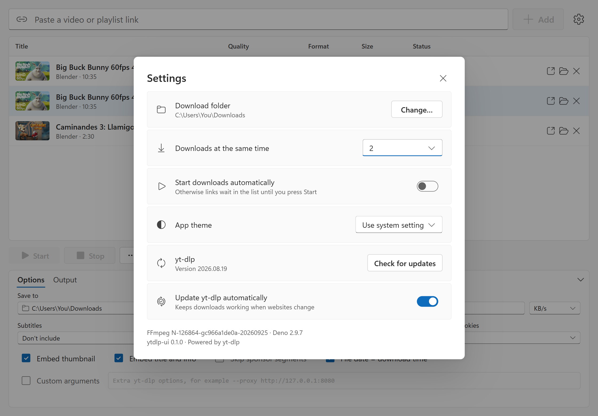
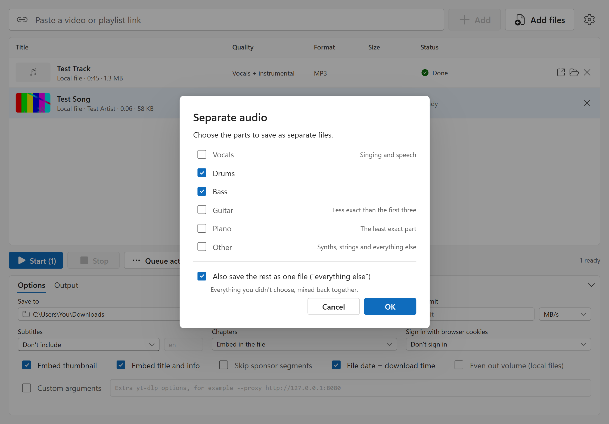

<div align="center">


# ytdlp-ui

**A simple, modern desktop app for [yt-dlp](https://github.com/yt-dlp/yt-dlp).**<br>
Paste links, pick a quality for each, press Start. YouTube videos, playlists and music, plus 1000+ other sites.<br>
Have files already? Drop them in to extract the audio, change the format, shrink them, or separate the vocals, drums and bass.

[](https://github.com/yohannzapata/ytdlp-ui/releases/latest)
[](https://github.com/yohannzapata/ytdlp-ui/releases)
[](LICENSE)


</div>

## Why ytdlp-ui?

yt-dlp is the best video downloader there is, but it lives in a terminal. ytdlp-ui puts a simple interface on top of
it: a queue you can fill with links, an options panel for everything you would otherwise type as command-line
flags, and none of yt-dlp's power taken away. Files you already have can go through the same queue, so one app
covers getting media, converting it and, if you want, pulling it apart into vocals, drums, bass and more.

- **Simple by default, complete when you need it.** Paste, choose, Start. Speed limit, subtitles, chapters,
  SponsorBlock, browser cookies and custom arguments are one glance away in the options panel.
- **Tiny.** The Windows installer is under 3 MB. No bundled browser, no background services.
- **Nothing to set up.** On first launch it downloads yt-dlp, FFmpeg and Deno for you.
- **Always working.** Websites change constantly. ytdlp-ui keeps yt-dlp up to date on its own, so downloads don't
  suddenly break.
- **Clean and simple.** One screen, no clutter, with light and dark themes that follow your system.

## Features

**Queue**
- Paste one link or many, on one line each. **Ctrl+V** anywhere in the window adds what you copied.
- Every row has its own **quality** (only the resolutions that video really has, with size estimates) and **format**
  (MP4, MKV, WebM, or MP3, M4A, Opus)
- Live progress, speed and time left. Several downloads at once (you choose how many), cancel, retry and **Start /
  Stop** for the whole queue
- The queue is remembered when you close the app
- **Playlists:** tick the videos you want; they're saved into a folder named after the playlist
- Open a finished file or show it in its folder in one click

**Your own files** (drop them on the window, or press **Add files**)
- Use the same two menus as downloads: **Audio only · MP3** extracts the audio, **720p · MP4** shrinks a video,
  **MKV to MP4** changes the container
- Nothing is re-encoded when it doesn't need to be, so extracting AAC audio from a video or moving H.264 from MKV to
  MP4 is instant and loses no quality
- Songs keep their cover art, title and artist; **Even out volume** brings quiet files to a standard loudness
- Your original file is never touched; the result is saved next to your downloads

**Separate audio** (an optional add-on, any audio or video file)
- Choose **Separate audio…** in a file's Quality menu, or press the split button on a finished row, then tick the
  parts you want: **vocals, drums, bass, guitar, piano, other**. Each one is saved as its own file
- Whatever you didn't tick can be saved as **one more file**: tick only Vocals to get a vocals file and an
  *instrumental*, or only Drums to get the drums and a *no drums* backing track
- Saved as MP3 (320 kbps), FLAC or WAV (24-bit), and the parts line up exactly with the original
- Runs on your computer with [Demucs](https://github.com/facebookresearch/demucs). Your files are never uploaded
- Downloaded only when you first use it (about 0.8 GB, or about 5 GB with the optional NVIDIA graphics card
  build) and removable any time in Settings. Guitar and piano use a second model; piano is the least exact part

**Options** (the panel under the queue)
- Download folder and **speed limit**
- **Subtitles:** embed them in the video or save an `.srt` next to it, in the languages you choose
- **Chapters:** embed, split into separate files (with optional forced keyframes), or ignore
- Embed thumbnail (cover art) and title/artist info; skip sponsor segments (SponsorBlock)
- **Sign in with your browser's cookies** for age-restricted or members-only videos
- **Custom arguments** for anything else yt-dlp can do
- An **Output** tab showing exactly what yt-dlp printed for each download

**Safe and tidy**
- Never overwrites an existing file (`Title (1).mp4`); a video and its subtitle file always get the same number
- Canceling leaves no partial files behind
- Plain-English errors instead of raw command-line output
- Automatic yt-dlp updates (or update with one click), and light and dark mode

<div align="center">


</div>

<div align="center">

</div>

<sub>The first screenshots show "Big Buck Bunny" and "Caminandes 3: Llamigos", (c) Blender Foundation, [CC BY 3.0](https://creativecommons.org/licenses/by/3.0/). The last one shows two small test files.</sub>

## Download

Get the installer for your system from the **[latest release](https://github.com/yohannzapata/ytdlp-ui/releases/latest)**:

| System | File |
| --- | --- |
| Windows 10 / 11 | `ytdlp-ui_x.y.z_x64-setup.exe` (or the `.msi`) |
| macOS (Apple Silicon and Intel) | `ytdlp-ui_x.y.z_aarch64.dmg` / `ytdlp-ui_x.y.z_x64.dmg` |
| Linux | `.AppImage`, `.deb` or `.rpm` |

See the [changelog](CHANGELOG.md) for what changed in each version.

Windows is the most thoroughly tested platform. The macOS and Linux builds are produced automatically for every
release and get less testing. If something doesn't work there, please [open an issue](https://github.com/yohannzapata/ytdlp-ui/issues).

<details>
<summary><b>"Windows protected your PC" or "can't be opened because it is from an unidentified developer"</b></summary>

The app isn't code-signed yet (certificates cost money), so the first launch shows a warning.

- **Windows:** click **More info**, then **Run anyway**.
- **macOS:** open **System Settings > Privacy & Security**, scroll down and choose **Open Anyway**. Or run
  `xattr -dr com.apple.quarantine /Applications/ytdlp-ui.app` once in Terminal.

The source is right here and every release is built by GitHub Actions from this repository.
</details>

## How to use

1. Paste a video or playlist link (or press **Ctrl+V** anywhere). It appears in the list with its title and thumbnail.
2. Pick the **quality** and **format** for each row. Adjust the options below if you like. To convert files you
   already have, drop them on the window or press **Add files**; they use the same menus. To split the sound into
   parts, choose **Separate audio…** in the Quality menu.
3. Press **Start**. Open the file or its folder when it's done.

Prefer no extra click? Turn on **Start downloads automatically** in Settings.

## FAQ

**Which sites work?** Everything [yt-dlp supports](https://github.com/yt-dlp/yt-dlp/blob/master/supportedsites.md):
YouTube, Vimeo, Twitter/X, Instagram, TikTok, SoundCloud, Twitch and over a thousand more.

**Is it free?** Yes. It's open source under the MIT license.

**Why does the first launch download files?** yt-dlp, FFmpeg (joins video and audio, converts to MP3) and Deno
(needed for YouTube) are separate programs. ytdlp-ui downloads them once from their public releases into its own
folder. If you already have FFmpeg or Deno installed, those are used instead.

**A download stopped working. What now?** Open **Settings** and press **Check for updates**. yt-dlp releases fixes
quickly whenever a site changes. A one-off "download was blocked" error often goes away with **Try again**.

**How do I download an age-restricted or members-only video?** In the options panel, choose the browser you're
signed in to under **Sign in with browser cookies**. If Chrome or Edge don't work for you, Firefox usually does.

**Where are my files?** In the folder shown under **Save to** in the options panel. Your Downloads folder by
default.

**Does it collect any data?** No. There is no telemetry and no account. The app only talks to the sites you
download from, and to GitHub to fetch yt-dlp, FFmpeg and Deno (on macOS, FFmpeg comes from
[ffmpeg.martin-riedl.de](https://ffmpeg.martin-riedl.de) instead). If you turn on **Separate audio**, it also
downloads the uv installer and a private Python from GitHub, the Python packages from PyPI and pytorch.org, and the
separation models from Hugging Face (Meta's file server is the fallback), once. Your audio itself is never uploaded.

**What is Separate audio, and what does it need?** It splits the sound of any audio or video file into vocals,
drums, bass, guitar, piano and other sounds, using the open-source Demucs model. It needs a one-time download
(about 0.8 GB; about 5 GB if you tick the NVIDIA option) into the app's own folder, and **Remove** in Settings
deletes it again. It runs on the processor unless you chose the NVIDIA option: on a recent PC a 45-second clip took
about half a minute (roughly ten seconds of that is starting up), and older computers will be slower. Results depend
on the song, and guitar and piano are less exact than vocals, drums and bass.

## Known limitations

- The app isn't code-signed yet (see above)
- The queue is remembered, but the **Output** log of past downloads is not
- macOS and Linux get less testing than Windows. **Separate audio** has only been tried on Windows so far, and on
  macOS it runs on the processor
- **Separate audio** writes each part as an uncompressed file while it works, so a very long file (an hour or more)
  needs several GB of free space until it finishes

## Build from source

You need [Node.js](https://nodejs.org) and [Rust](https://rustup.rs), plus the
[Tauri prerequisites](https://tauri.app/start/prerequisites/) for your system.

```bash
git clone https://github.com/yohannzapata/ytdlp-ui.git
cd ytdlp-ui
npm install
npm run tauri dev      # run with hot reload
npm run tauri build    # build an installer into src-tauri/target/release/bundle
```

Run the Rust tests with `cargo test` inside `src-tauri`.

### How it works

ytdlp-ui never imports yt-dlp. It runs the standalone yt-dlp program and reads its output (`--progress-template`
prints one line of JSON per progress update). That way yt-dlp can update itself when websites change, without a
new release of this app, and canceling a download is just stopping a process. Each download works in its own hidden
folder and is moved into place when it finishes, which is what makes canceling clean and overwriting impossible.

| Part | Where |
| --- | --- |
| Downloading and updating yt-dlp, FFmpeg and Deno | [`src-tauri/src/tools.rs`](src-tauri/src/tools.rs) |
| Running yt-dlp: info, options to arguments, downloads, progress, cancel | [`src-tauri/src/ytdlp.rs`](src-tauri/src/ytdlp.rs) |
| Local files: reading them and converting with FFmpeg | [`src-tauri/src/media.rs`](src-tauri/src/media.rs) |
| Separate audio: the optional Demucs add-on (private Python, install, separate) | [`src-tauri/src/stems.rs`](src-tauri/src/stems.rs) |
| Settings and download options | [`src-tauri/src/settings.rs`](src-tauri/src/settings.rs) |
| Typed calls from the UI to Rust | [`src/api.ts`](src/api.ts) |
| Queue and app state | [`src/store.ts`](src/store.ts) |
| Screens | [`src/components/`](src/components) |

**Stack:** [Tauri 2](https://tauri.app) (Rust) · React 19 · TypeScript · Vite.

## Legal

ytdlp-ui is an independent project and is not affiliated with yt-dlp, YouTube or any other site. Only download
content you own or have permission to download, and follow the terms of the sites you use.
yt-dlp, FFmpeg and Deno are separate programs with their own licenses; they are downloaded at first launch, not
bundled with this app. The same goes for the optional Separate audio add-on: Demucs (MIT), PyTorch and the
model files are downloaded when you ask for it and never bundled.

## License

[MIT](LICENSE) © Yohann Joachim Zapata
