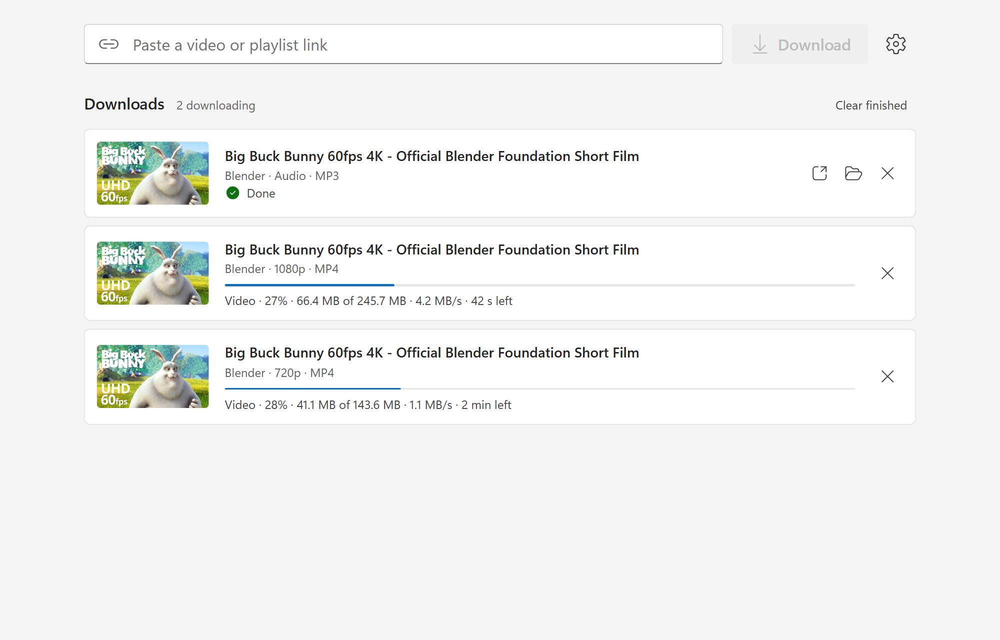
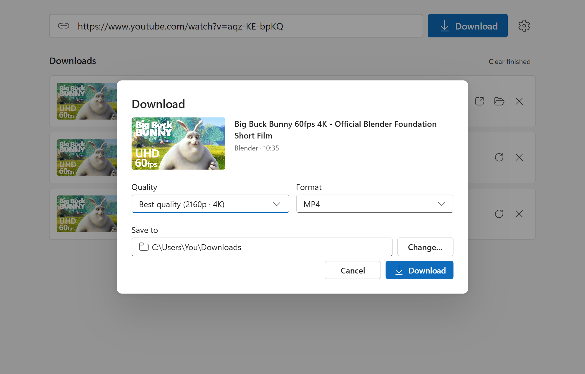
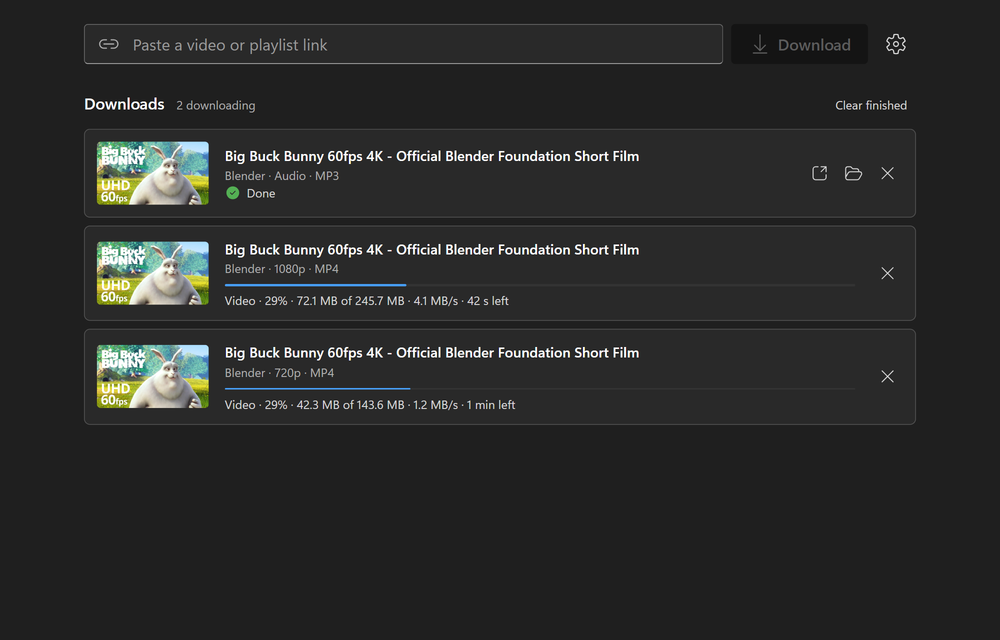

<div align="center">


# ytdlp-ui

**A simple, modern desktop app for [yt-dlp](https://github.com/yt-dlp/yt-dlp).**<br>
Paste a link, pick a quality, download. YouTube videos, playlists and music, plus 1000+ other sites.

[](https://github.com/yohannzapata/ytdlp-ui/releases/latest)
[](https://github.com/yohannzapata/ytdlp-ui/releases)
[](LICENSE)




</div>

## Why ytdlp-ui?

yt-dlp is the best video downloader there is, but it lives in a terminal. ytdlp-ui puts a clean, Windows-11-style
interface on top of it, without giving up any of its power or its constant updates.

- **Tiny.** The Windows installer is under 3 MB. No bundled browser, no background services.
- **Nothing to set up.** On first launch it downloads yt-dlp, FFmpeg and Deno for you.
- **Always working.** Websites change constantly. ytdlp-ui keeps yt-dlp up to date on its own, so downloads don't
  suddenly break.
- **Looks native.** Built with Microsoft's Fluent UI, with light and dark themes that follow your system.

## Features

- **Video and playlist downloads** from YouTube and every site yt-dlp supports
- **Quality picker** that only offers resolutions the video really has, with size estimates
- **Video formats:** MP4 (H.264, plays everywhere), MKV, WebM
- **Audio extraction:** MP3, M4A or Opus, with cover art and title/artist tags
- **Playlists:** tick the videos you want; they're saved into a folder named after the playlist
- **Download queue** with live progress, speed and time left. Run several downloads at once, cancel or retry any
  of them.
- **Safe file handling:** never overwrites an existing file (`Title (1).mp4`), and canceling leaves no partial
  files behind
- **Plain-English errors** instead of raw command-line output
- **Automatic yt-dlp updates** (or update with one click)
- **Light and dark mode**

<div align="center">


</div>

<sub>Screenshots show "Big Buck Bunny", (c) Blender Foundation, [CC BY 3.0](https://creativecommons.org/licenses/by/3.0/).</sub>

## Download

Get the installer for your system from the **[latest release](https://github.com/yohannzapata/ytdlp-ui/releases/latest)**:

| System | File |
| --- | --- |
| Windows 10 / 11 | `ytdlp-ui_x.y.z_x64-setup.exe` (or the `.msi`) |
| macOS (Apple Silicon and Intel) | `ytdlp-ui_x.y.z_aarch64.dmg` / `ytdlp-ui_x.y.z_x64.dmg` |
| Linux | `.AppImage` or `.deb` |

Windows is the most thoroughly tested platform. The macOS and Linux builds are produced automatically for every
release and get less testing. If something doesn't work there, please [open an issue](https://github.com/yohannzapata/ytdlp-ui/issues).

<details>
<summary><b>"Windows protected your PC" or "can't be opened because it is from an unidentified developer"</b></summary>

The app isn't code-signed yet (certificates cost money), so the first launch shows a warning.

- **Windows:** click **More info**, then **Run anyway**.
- **macOS:** open **System Settings > Privacy & Security**, scroll down and choose **Open Anyway**. Or run
  `xattr -dr com.apple.quarantine /Applications/ytdlp-ui.app` once in Terminal.

The source is right here and every release is built by GitHub Actions from this repository.
</details>

## How to use

1. Paste a video or playlist link and press **Download**.
2. Choose the quality and format. Playlists let you tick the videos you want.
3. Watch it in the queue. Open the file or its folder when it's done.

## FAQ

**Which sites work?** Everything [yt-dlp supports](https://github.com/yt-dlp/yt-dlp/blob/master/supportedsites.md):
YouTube, Vimeo, Twitter/X, Instagram, TikTok, SoundCloud, Twitch and over a thousand more.

**Is it free?** Yes. It's open source under the MIT license.

**Why does the first launch download files?** yt-dlp, FFmpeg (joins video and audio, converts to MP3) and Deno
(needed for YouTube) are separate programs. ytdlp-ui downloads them once from their public releases into its own
folder. If you already have FFmpeg or Deno installed, those are used instead.

**A download stopped working. What now?** Open **Settings** and press **Check for updates**. yt-dlp releases fixes
quickly whenever a site changes.

**Where are my files?** In the folder you choose in the download dialog or in Settings. Your Downloads folder by
default.

**Does it collect any data?** No. There is no telemetry and no account. The app only talks to the sites you
download from, and to GitHub to fetch yt-dlp, FFmpeg and Deno (on macOS, FFmpeg comes from
[ffmpeg.martin-riedl.de](https://ffmpeg.martin-riedl.de) instead).

## Known limitations

- The download list is cleared when you close the app
- No support yet for logging in (age-restricted or members-only videos), subtitles or cookies
- The app isn't code-signed yet (see above)

## Build from source

You need [Node.js](https://nodejs.org) and [Rust](https://rustup.rs), plus the
[Tauri prerequisites](https://tauri.app/start/prerequisites/) for your system.

```bash
git clone https://github.com/yohannzapata/ytdlp-ui.git
cd ytdlp-ui
npm install
npm run tauri dev      # run with hot reload
npm run tauri build    # build an installer into src-tauri/target/release/bundle
```

Run the Rust tests with `cargo test` inside `src-tauri`.

### How it works

ytdlp-ui never imports yt-dlp. It runs the standalone yt-dlp program and reads its output (`--progress-template`
prints one line of JSON per progress update). That way yt-dlp can update itself when websites change, without a
new release of this app, and canceling a download is just stopping a process.

| Part | Where |
| --- | --- |
| Downloading and updating yt-dlp, FFmpeg and Deno | [`src-tauri/src/tools.rs`](src-tauri/src/tools.rs) |
| Running yt-dlp: info, downloads, progress, cancel | [`src-tauri/src/ytdlp.rs`](src-tauri/src/ytdlp.rs) |
| Settings file | [`src-tauri/src/settings.rs`](src-tauri/src/settings.rs) |
| Typed calls from the UI to Rust | [`src/api.ts`](src/api.ts) |
| Download queue and state | [`src/store.ts`](src/store.ts) |
| Screens | [`src/components/`](src/components) |

**Stack:** [Tauri 2](https://tauri.app) (Rust) · React 19 · TypeScript · [Fluent UI](https://react.fluentui.dev) · Vite.

## Legal

ytdlp-ui is an independent project and is not affiliated with yt-dlp, YouTube or any other site. Only download
content you own or have permission to download, and follow the terms of the sites you use.
yt-dlp, FFmpeg and Deno are separate programs with their own licenses; they are downloaded at first launch, not
bundled with this app.

## License

[MIT](LICENSE) © Yohann Joachim Zapata
